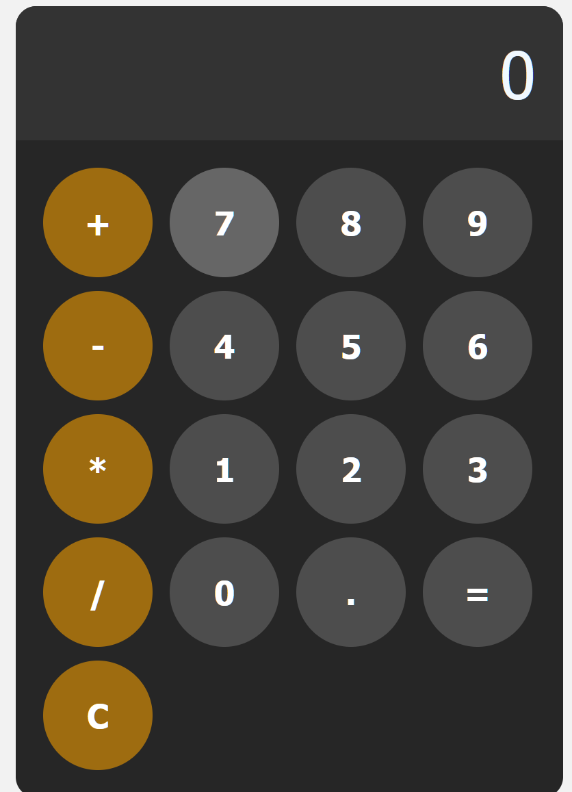

# Simple Web Calculator🧮

A clean, responsive calculator built with HTML, CSS, and JavaScript.

 <!-- Add a screenshot if available -->

## Features🖊

- Basic arithmetic operations (+, -, *, /)
- Decimal point support
- Clear button (C)
- Error handling for invalid expressions
- Responsive design that works on mobile and desktop
- Visual feedback on button presses

## Technologies Used🖥

- HTML5
- CSS3
- JavaScript (Vanilla JS)
  
## How to Use🛠

1. Clone this repository or download the files
2. Open `index.html` in any modern web browser
3. Use the calculator by:
   - Clicking number buttons (0-9)
   - Selecting an operation (+, -, *, /)
   - Pressing "=" to calculate
   - Pressing "C" to clear

## Code Structure🧩

- `index.html` - Main HTML structure
- `styles.css` - Styling for the calculator
- `script.js` - Calculator logic

## Customization

To modify the calculator:

1. Change colors in `styles.css` (look for the `hsl()` values)
2. Adjust sizes in the CSS (font sizes, button dimensions)
3. Add more operations by extending the JavaScript functions

## Browser Support💻

Works on all modern browsers including:
- Chrome
- Firefox
- Safari
- Edge

## Author
- marthyvickyblessing@gmail.com

## License🎫

This project is open source and available under the [MIT License](LICENSE).
